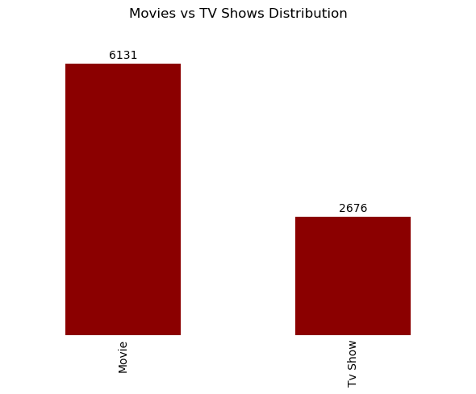
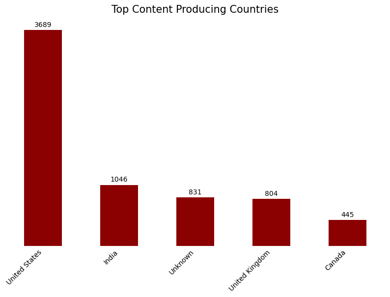
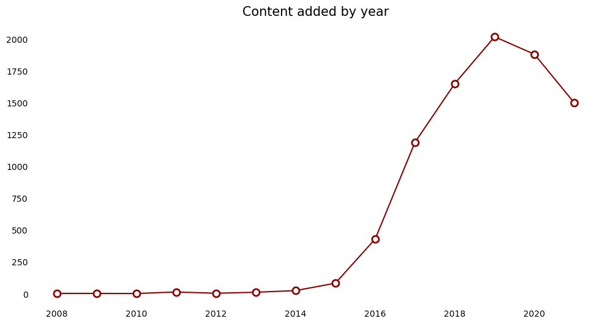
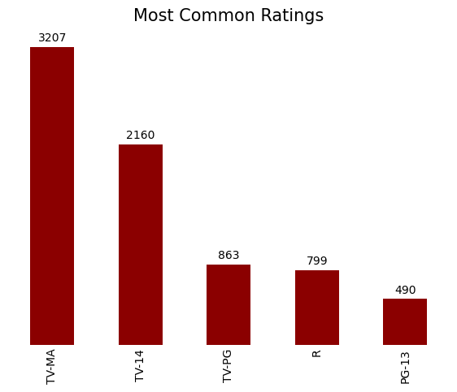
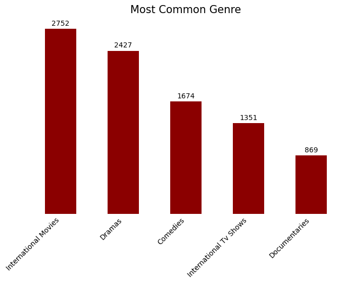

### 🎬 Netflix Movies & TV Shows Analysis

#### 📌 Project Overview

This project focuses on analyzing the Netflix Movies and TV Shows dataset to understand content distribution, identify data quality issues, explore trends, and generate meaningful insights about Netflix's content library.

The analysis involved:
- 🔍 Data understanding
- 🧹 Data cleaning and preparation
- 📊 Exploratory Data Analysis (EDA)
- 📈 Data visualization
- 💡 Insight generation

**Tools Used:**
- 🐍 Python (Pandas, NumPy, Matplotlib)
- 📓 Jupyter Notebook

---

### 🧹 Data Cleaning Challenges

Before analysis, the dataset was reviewed and cleaned to improve accuracy and reliability.

### Challenges Identified:

- **Missing Values**
  - Several columns contained missing information, especially **director**, **cast**, and **country**.
  - Missing values were assessed and handled based on their impact on analysis.

- **Incorrect Data Formats**
  - Date-related fields required conversion into proper datetime formats to support accurate time-based analysis.

- **Inconsistent Records**
  - The rating column contained incorrect entries where some duration values (e.g., "74 min", "84 min") appeared instead of actual ratings.
  - These records required investigation and correction.

- **Text Standardization**
  - Text columns were cleaned by removing extra spaces and standardizing formatting to improve consistency.

---

### 🔎 Exploratory Data Analysis Findings

EDA was conducted to identify patterns, trends, and relationships within Netflix's content library.

#### Key Findings:

🎥 **Content Type Distribution**
- Netflix contains significantly more movies than TV shows, showing a stronger focus on movie content.

🌎 **Content Production Analysis**
- The United States is the leading content-producing country, with a large gap compared to other countries.

📅 **Content Growth Trends**
- Netflix content additions increased rapidly between 2014 and 2019, reaching a peak around 2019.

🔞 **Audience Rating Analysis**
- TV-MA is the most common rating, indicating that a large proportion of Netflix content targets mature audiences.

🎭 **Genre Analysis**
- International Movies and Drama are among the most common genres, highlighting Netflix's focus on diverse global content.

---

### 💡 Key Insights

#### 1️⃣ Movies dominate Netflix's content library 🎬

The dataset contains **6,131 movies and 2,676 TV shows**. Movies represent more than twice the number of TV shows, indicating that Netflix's library has a stronger focus on movie content.

---

#### 2️⃣ The United States dominates Netflix content production 🇺🇸

The United States is the largest content-producing country in the dataset, with a substantial lead over other countries. It produces approximately **three times more content than India**, the second-highest producing country, showing the dominance of US-produced titles on Netflix.

---

#### 3️⃣ Netflix content expanded rapidly between 2014 and 2019 📈

The number of titles added to Netflix increased significantly between 2014 and 2019, reaching its highest point around 2019. This period represents a major expansion of Netflix's content library.

---

#### 4️⃣ Netflix content is mainly targeted toward mature audiences 🔞

TV-MA is the most common rating with **3,207 titles**, followed by TV-14 with **2,160 titles**. This shows that a large portion of Netflix's content is designed for mature and teenage audiences.

---

#### 5️⃣ Netflix has a strong focus on global and drama content 🌍

Genre analysis shows that **International Movies and Drama** are among the most common categories on Netflix, reflecting the platform's strategy of providing diverse content for a worldwide audience.

---

### ✅ Conclusion

The analysis reveals Netflix's growth as a global streaming platform with a strong emphasis on movies, international productions, and mature audience content. Through data cleaning, EDA, and visualization, valuable patterns were identified that demonstrate how Netflix's content library has evolved over time.